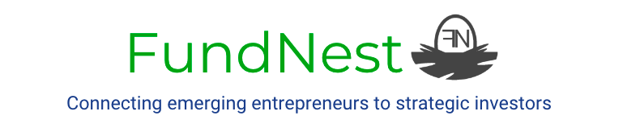

# FundNest
### RuHacks21

## Problem/Need 🤔
A lack of connections between emerging businesses and investors seeking new investment opportunities. Start-ups, small businesses, and entrepreneurs continuously face difficulty securing funding to finance their business operations and new ideas. The issue is the same for the investing parties, investors do not have the ability to readily browse all the options available for various business investments when they are interested in committing funds. Business entities are uncertain of which investors are interested in funding their operations, whereas investors are forgoing many big and small investment opportunities due to unrecognized fund demand. 


## Solution :bulb:
FundNest aims to address this need by creating a global network between emerging businesses seeking funding and investors who intend to earn financial returns. Our goal is to bridge the gap between fund supply and demand in all communities to flourish the world economy. FundNest aids entities to connect with investors who are interested in funding their business ideas and it allows any big- or small-scale investor to gain profitable returns by supporting businesses locally and/or globally. Our MVP is an easy to use UI for entrepreneurs and small-sized businesses seeking funding from potential investors near them. Our product includes a registration page for entrepreneurs and investors where they can enter their credentials as well as the funding they intend to seek or contribute. Moreover, both types of users can view a list of investors and businesses available to engage with and find their precise location via maps. Entrepreneurs and investors also have to ability to directly add funds in their accounts. 


## Community and Economic Impact :hands
FundNest is conscious about its impact in society and strives to create a positive community and economic impact.
By matching entrepreneurs to investors, FundNest promotes the growth of early-stage businesses within all communities around the world. The web app also establishes standards of inclusivity by allowing any certified investor to actively engage in investment practices with licensed businesses. Furthermore, any individual or company has the flexibility to invest only the amount of money they are comfortable committing. Both early-stage businesses and new investors now have the chance to advance themselves by developing mutually beneficial connections with one another. 

## What we Learned
  * Creating a UI/UX prototype for a web app using [Figma](https://www.figma.com/file/h409POgJUFiN322P9FXj0L/RU-Hacks?node-id=0%3A1)
  * Connecting existing data in Json to Google Maps API
  * Incorporating Dynamic UI fixes to the Google Maps in React JS 
  * Locally storing and creating fake data using random generated profiles and incorporating into the React flow for an easy fetch
  * Routing and connecting different pages to create a complete web app in React JS


## Implementation of FundNest 🔨
Using ***ReactJS*** as the front-end framework along with the ***MaterialUI*** library, FundNest is an easy to use UI for investors and companies seeking funding. To showcase nearby investors for a company, a version of Google Maps is used with the help of ***Google Maps API***. Additonally, markers on the map correspond with the search results presented to the user which are fetched from a **JSON** that currently stores all "investors" for this early-stage software. 


## How to Start the Webapp 💻
```bash
git clone https://github.com/Hima27/RuHacks21.git
npm i
npm start
```

## Future Plans for FundNest :chart:
  * Enabling investors to browse for businesses to invest in 
  * Implement an accurate database reflecting real clients and investors
  * Implement a method of verifying all users to establish legitimacy
  * Ability for investors and companies to search for nearby legal counsel to solidify agreement
